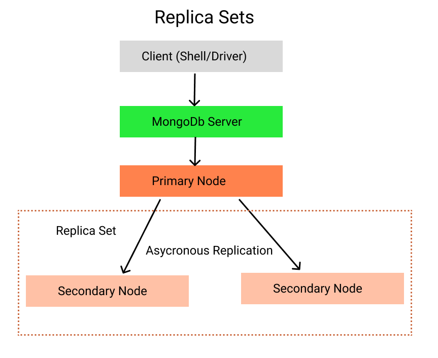
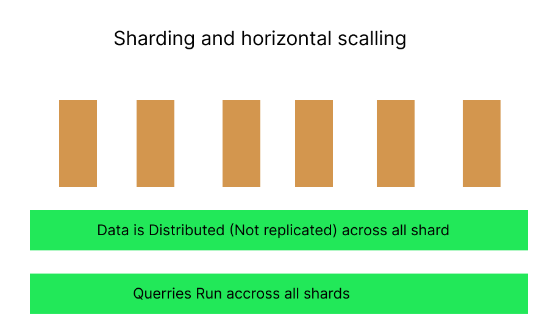
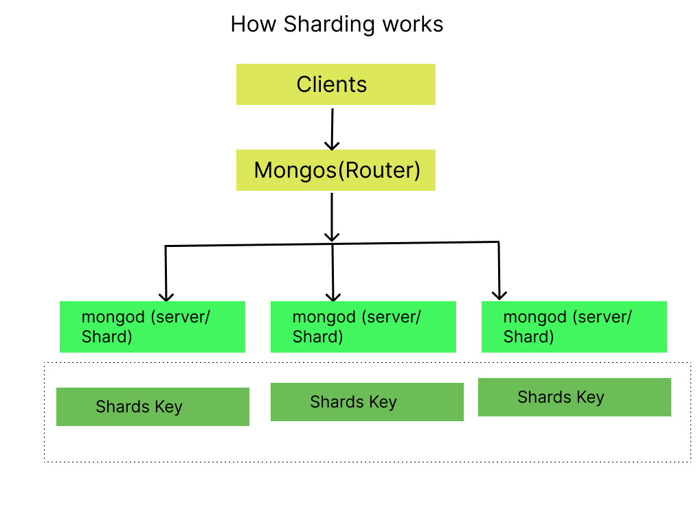

# What Influence Performance
1. Efficient Quaries/Operations
2. Indexes-right indexes of data
3. Fitting Data Schema-right data that fits your application

-These are developer Related Task
#### H/W and network
1. sharding
2. Replica set
3. 
these are typlical DB admin and system admin task not devloper.

#### Capped Colletion
A limit of collection is capped and the older 
document gets deleted when the size exceeds the certain
limit.can be used in caching and creating log files.

```js
use  performance
db.createCollection("capped",{capped:true;size:10000;max:3})
{ok:1}
db.capped.insertOne({name:max});
db.capped.insertOne({name:manu});
db.capped.insertOne({name:anna});
db.capped.find().pretty()
//size-> the default is 400byte and 10000 bytes is 10MB
//max--> is the optional and is the maximum document that can be inserted
```
1. at capped collection the order is the oreder how they were insered
2. you can also create indexes there.
3. if you add another document ,it will throw an error instead it will make space to accomodate another document by clearing out the last added one.
4. there is automatic clearing of data can be used in logging and caching.
5. this can improve the performance.

# Replica Sets


1. Created by System Admin.
2. Replica means create a multiple mondb servers
3. replication of data takes place all these server asyc
4. if any node or primary node gets down we can talk to another node in that network to still read.
5. this provides fault tollerance
6. primary node changes whenever node gets down
7. read only takes at primary node and incase of
8. multiple requests the I/O can be splitted to multiple nodes
9. the secondary node hold a election to select when a primary node goes down.


# Sharding


1. all about horizontal scaling
2. muliple server splits up available data
3. data is distributed accross the shards not replicated
4. querries run accross all shards
5. mongos (router)is responsible for inserting data to the right shards.
6. shards key is document added to each server that help identify where the data is belongs to. it is the task done by the system admin.
   
# How shard Working


# Querrying and Sharding


1. provide the shard key in `find()` query to help it identify which shards contain your data. in such a case the mongo has to boradcast your query to all the shards and each shard has to check if iam reponsible to have that data then each reture its response whether it has data or no data and then mongo has to merge it all the data
2. option 2 is that your query contains a shards key and you were able to target the correct shards and then mongos can directly forward the query to right shrad
3. the shards key should evenly distributed so that shard key can used- all about distributing data.
   
# Deploy A Mongodb server
1. use mongodb atlas to deploy 
2. free-tier on AWS
3. Now clusters simply describe a mongodb environment,
a cluster contains all your shards, all your replica sets
it's basically what you deploy, it's your deployed mongodb server.
4. build a new cluster 
5.  configure your mongodb environment

