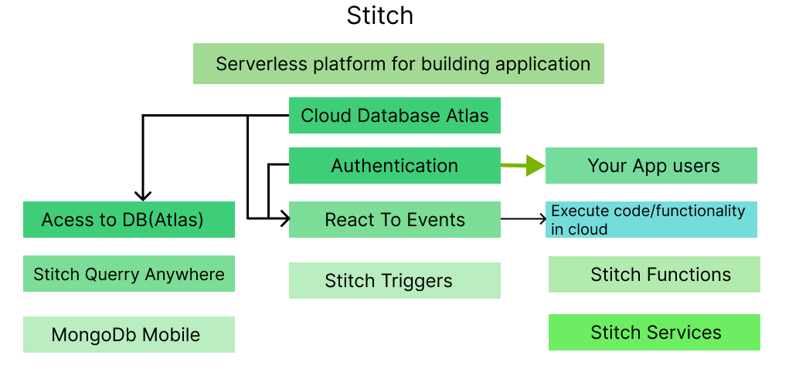
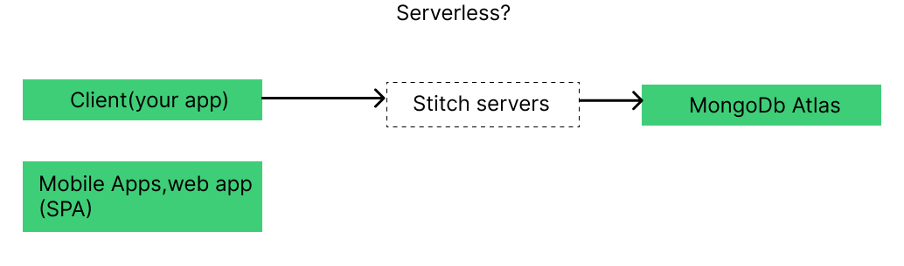

# What is Stitch?

It's a serverless platform for building applications you could say, it's a collection of services offered by the mongodb company that you can use when building an app and with app, I mean basically a web app or a mobile app or also a desktop app, so that you get to focus
on your user interface and your core logic even the logic which should run on a server,so on a backend but you don't have to write the entire boilerplate for setting up the server, for managing the

server or for example for creating a restful API on your own, that is all handled by stitch. It all is kind of built around Atlas as a cloud database or at least integration with that is particularly easy and one core feature for example is *authentication*.

I'm talking about the *authentication* we have in our app to support users or even if we don't want users,even in such a case, there is a solution.

Now why is that important? Because stitch gives us access to our mongodb Atlas database and this access will then be available from inside our client side application, for example.

we shouldn't access the database from in there because we don't want to expose our database credentials.Now the idea behind stitch's solution here is that it doesn't expose our database credentials,

instead our application users can sign up and log in through stitch's service and the user will get temporary credentials for finegrained access to the database and we can lock down what a single user can do,
so we could say a user is allowed to insert documents into this collection and there, he may set that and that field, this field may not be changed by the user,we can lock that down and I will show you how to set up such rules in this module. And therefore, we can pass the *authentication* or the rights to the users of our app because they don't have full access to the database as they would have with our mongodb credentials which are not exposed.

So stitch manages this behind the scenes for us, that it takes our rules into account and make sure that users do have access to the database but only to exactly the things they have to do like create new products which 

So this is one important piece. We can also **react to events** in stitch,
so for example if something gets inserted into a database or something gets updated, we can run some code that does something, sends an e-mail or log something into another collection or whatever we need to do and that's the third building block, we can execute code or some kind of functionality in the cloud.

So stitch is not just a toolset which helps us build beautiful UIs or client side code, we can still execute code in the cloud with so-called functions,so essentially just code snippets which we define where we don't have to write the boilerplate of parsing incoming requests or exposing routes in a restful API but where we just write a code we want to execute and then we can either call that code directly from inside the client or from inside another function or we set up a trigger with that middle position there, **react to events**, we set up a trigger to execute a certain code snippet when for example something gets inserted.

So we're really flexible here and if you worked with something like firebase or AWS Lamda, well then this function part on the right here would essentially be Lamda or firebase cloud functions and mongodb stitch as a whole is kind of mongodb's answer to firebaseyou could say, if you know these tools.

Now in detail, for accessing the database, we got stitch query  anywhere which is their solution to allow us to run queries based on the rules we set up for the users of our app directly to our database.

There also is *mongodb mobile*,mongodb mobile is basically a local mongodb database you could say which you can install on mobile devices so that you can store data and sync it to the cloud even when you are offline,so store the data when you're offline, sync it to the cloud when you're back online.That is a whole different topic and I'll not cover it here.

**React to events**, that is **stitch triggers**, that's simply the name of the service which allows us to configure triggers that will then call **stitch functions** and additionally there's a feature called **stitch services** which allows us to integrate stitch with other services,like for example AWS S3,
that would be useful for uploading files because stitch has no built-in file storage,so we got no solution for storing files, mongodb itself is a bad solution,a database should not be used as a file storage and there is no other service that would allow us to store files.and that could be solved by using **stitch services** reach out to AWS S3 which is a file storage and then communicate with that and store files and you find plenty of examples for such use cases in the official stitch documentation,
so definitely dive into that if you're interested in more details.

So this is the big picture,
we get our cloud database which we can work with with stitch query anywhere,
we also got the events where we can listen to *authentication* or database events and then we can execute code in the cloud and we can always execute that code not just upon events but also call it manually.

That is the idea here and the idea is that we build our client side application and we also have some server side logic still, we have some code that should run on the server,we also have our mongodb database or Atlas to be precise and in the last module, we built our own backend, the node rest API that talked to Atlas.

Now this will be replaced with the stitch service you could say,
so even though I called it serverless, there still are servers somewhere but stitch manages a lot of the boilerplate,a lot of the heavy lifting for us and we just communicate to our services, to atlas, to other services like database functions and so on,we do that with the help of the sdk. And now we can focus only on our user interface and our logic and not on all the boilerplate.

