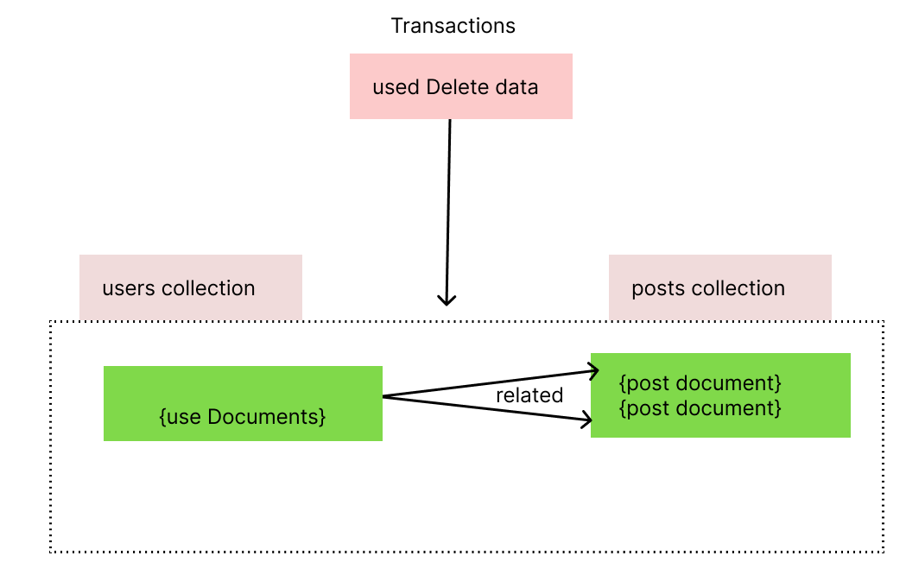

# Transactions

So what are transactions? Well let's consider this use case, we have a users and we have a posts collection and we get a couple of documents in there and let's say each user or most users have a couple of posts. So the posts are related to users because the user is the person who created the post. So we have that stored relation, maybe stored with a reference, so with a key stored in a user or in a post document, doesn't really matter.

Now we delete the user account and therefore we want to delete the documents here together, so in two collections. Now this can be done without transactions,we can simply delete a user and right before we do that, we save the ID of that user, we find out the user id and then we reach out to the posts collection, find all posts who are linking to that user ID and delete these posts,that is perfectly possible without transactions.


Now the thing just is what happens when we actually have a use case where deleting the user succeeds but during deleting the posts, somehow something goes wrong? We have a temporary server outage,we have a network issue, whatever it is. So then we end up in a state where the user was deleted but the posts are still there but the user they're pointing at doesn't exist anymore, this is exactly the use case where transactions help us. With a transaction, we can basically tell mongodb hey these operations as many as you want either succeed together or they fail together and you roll back,
so you restore the database in the state it was in before the transaction regarding the documents that were affected in the transaction.


That is the idea behind transactions,
let's now try that out and again for that, you need mongodb 4
and a replica set, so that is why I will use the mongodb Atlas deployment.

# Transaction Working

Creating the posts in blog database

```js
db.posts.insertOne({title:"new posrts"})
{ acknowledged: true,
  insertedId: ObjectId("6334025b4379436d7a4ee782") }
db.posts.insertOne({title:"new posts 2"})
{ acknowledged: true,
  insertedId: ObjectId("633402634379436d7a4ee783") }
```

Inserting Users
```js
db.users.insertOne({"name":"user1"})
{ acknowledged: true,
  insertedId: ObjectId("6334029d4379436d7a4ee784") }

db.users.insertOne({"name":"user2"})
{ acknowledged: true,
  insertedId: ObjectId("633402a04379436d7a4ee785") }

db.users.find()
{ _id: ObjectId("6334029d4379436d7a4ee784"), name: 'user1' }
{ _id: ObjectId("633402a04379436d7a4ee785"), name: 'user2' }


```

Transaction Working
```js
1. const session=db.getMongo().startSession()
2. session.startTransaction()
3. const userCol=session.getDatabase("blog").users
4. const postCol=session.getDatabase("blog").posts

5. db.users.find().pretty()
{ _id: ObjectId("6334029d4379436d7a4ee784"), name: 'user1' }
{ _id: ObjectId("633402a04379436d7a4ee785"), name: 'user2' }

6. userCol.deleteOne({_id:ObjectId("633402a04379436d7a4ee785")})
7. db.users.find().pretty()
{ _id: ObjectId("6334029d4379436d7a4ee784"), name: 'user1' }
{ _id: ObjectId("633402a04379436d7a4ee785"), name: 'user2' }

8. postCol.deleteOne({_id:"ObjectID("633402a04379436d7a4ee785")"})
9. db.posts.find().pretty()
{ _id: ObjectId("6334025b4379436d7a4ee782"),
  title: 'new post1' }
{ _id: ObjectId("633402634379436d7a4ee783"),
  title: 'new post2' }
//commit delete
// session.abortTransaction()

10. session.commitTransaction()
11. db.users.find().pretty()
// no results

```